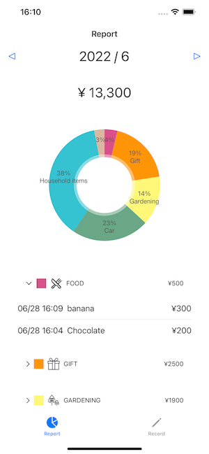
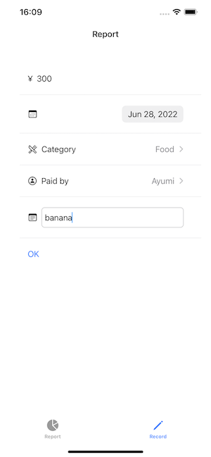

<!-- PROJECT LOGO -->
 

    
<h3 align="center">Accounting Together</h3>

<!-- ABOUT THE PROJECT -->
## About The Project

A simple accounting app developed to practice SwiftUI.

## Built With

[Swift](https://developer.apple.com/documentation/swift)

<!-- ACKNOWLEDGMENTS -->
## Acknowledgments

* [Charts](https://github.com/danielgindi/Charts)
* [realm](https://github.com/realm/realm-swift)
